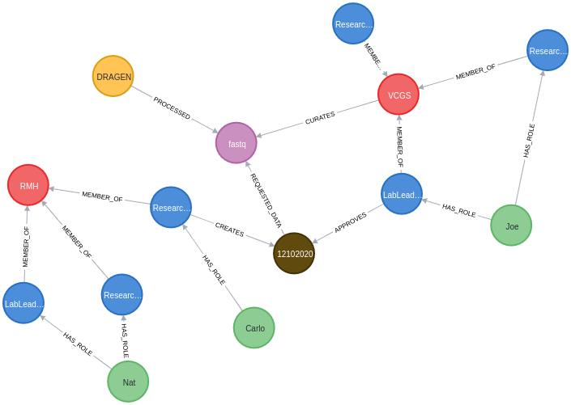

# cds-graphql

## How to play with it:
### Install neo4j
    [Install Neo4j](https://neo4j.com/docs/operations-manual/current/installation/)
### Fill the db
  run *dummmy-data.cyp* to fill the database
### Install packages
  `npm install`
### Start graphQL endpoint
  `nodemon server.js`
### Modify typeDefs.js to extend the schema

## Current schema:

